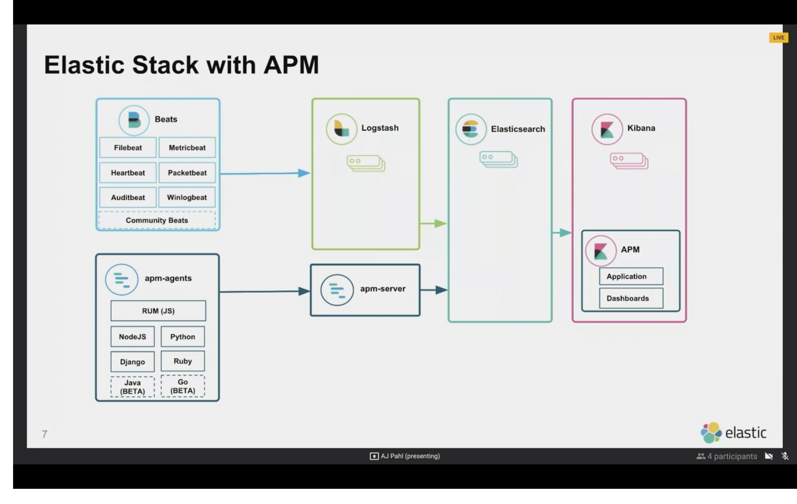

# labs-log-tracing

The aims of this lab is to reason about complexity related to decomposition of  an application in small microservices having each one multiple instances, its own log files an every one interacting to one or more service in order to offer a broader functionality.

We address two concerns:

- **Logs aggregation**

  When an application is decomposed in small services and every one can have several running instances and every one has it's own log files, how can we retrieve the necessary info on them in order to debug a problem? Can we find the location of every log file, can we access every one and find what we're searching for? 

  Obviously not: we need a single well known place where all logs are collected and accessible and we also need a way to search the info we need in a straightforward way.

  

- **Distributed Tracing**

  If our application is affected by poor throughput, all computations takes long time to complete, or everyting is fine but sometime something happens and we can observe performance degradation, how can we found where is the problem if the degraded use case is spanned across many and many microservices? Is there one of them where we have a bottleneck? How can we found where a transaction is taking the majority of the computation time?


Our sample application is composed by one downstream microservice that call other two upstream microservices

- **downstream-service**
- **upstream-service1**
- **upstream-service2**


The downstream service exposes a REST endpoint [http://localhost:10090/customers-info/{customer-id}](http://localhost:10090/customers-info/{customer-id}) and retrieves info related to a Customer given the customer id

The needed info are retrieved calling the upstream services in order to retrieve info related to:

Customers [http://localhost:8080/customers/{customer-id}](http://localhost:8080/customers/{customer-id})

Customer addresses [http://localhost:9090/addresses/customer/{customer-id}](http://localhost:9090/addresses/customer/{customer-id})


The info are composed and returned to the client

The application is described in the following picture:


In our lab we can support both **logs aggregation** and **distributed tracing** using the **Elastic stack**

http://elastic.co as described in the following image




Related to logs aggregation perspective:

Logs are collected by **Beats** (**FIlebeat** in our case) on every microservice machine or container, elaborated by **Logstash** (Extract Transform Load), ingested into **Elasticsearch** and then managed and visualized on **Kibana** in order to search the needed informations collected into logs.


Related to distributed tracing:

The **Elastic APM stack** can get trace info on every microservice machine or container using **APM agents** and collect them in **Elasticsearch** through an **APM server**.

APM data dan be visualized in **Kibana** using dedicated APM dashboards like the following one that describe the trace of API calls exposed as REST endpoint [http://localhost:10090/customers-info/{customer-id}](http://localhost:10090/customers-info/{customer-id} )  and the interaction between the downstream service and the upstream (collaborators) services and related time consumptions.


### Prerequisites

- Java 8
- Docker
- Docker Compose


### How to start the lab

Both the Elastic stack and the microservices are provided as a set of Docker containers and managed as Docker Compose file **environment/elk-stack/docker-compose.yml**

In order to start the lab, please open a shell window and type the following commands

`cd $PROJECT_HOME/environment/elk-stack`

`docker-compose up -d`


Docker Compose will start a set of Docker containers for the following components

**Elasticsearch** on ports 9200, 9300

**Kibana** on port 5601

**Logstash** on ports 5400, 9600


**Filebeat**

Filebeat is configured to scan log files on your laptop on folder $PROJECT_HOME/environments/logs/*/\*.log

This scan log files with .log extension on every subfolder on $PROJECT_HOME/environments/logs


**APM Server** on port 8200


**downstream-service** on port 10090

**upstream-service1** on port 8080

**upstream-service2** on port 9090


### Configure Kibana

Open Kibana at URL http://localhost:5601/app/kibana


#### Define Index Patterns

Go to *Management* -> *Index Patterns*


Click on button *Create index pattern*

enter the pattern **amp-*** and click on button *Next step* 

Set @timestamp as timestamp field


<br/><br/>

Click on button *Create index pattern*

enter the pattern **filbeat-*** and click on button *Next step

Set @timestamp as timestamp field


Click on button *Create index pattern

enter the pattern **metrics-*** 

Set @timestamp as timestamp field


In order to populate indexes on Elasticsearch open the URL  [http://localhost:10090/customers-info/{customer-id}](http://localhost:10090/customers-info/{customer-id} ) on browser chosing customer id on the list  customer-0001, customer-0002, customer-0003, customer-0004, customer-0005


Distributed traces can be found on **APM Dashboard**

Centrilezed logs can be found on **Logs Dashboard**


### Install JMeter

We will use JMeter in order to call the REST endpoint [http://localhost:10090/customers-info/{customer-id}](http://localhost:10090/customers-info/{customer-id} ) with a set of customer identifiers

```
cd jmeter

chmod +x install-jmeter.sh

./install-jmeter.sh
```


The script will download and unzip JMeter into the *$PROJECT_HOME/jmeter* folder


### Start JMeter

```
cd apache-jmeter-5.1.1/bin

./jmeter
```


### Run the test plan

To run the test plan

Click on *File* -> *Open* then choose the file test-plan.jmx

and start the test plan 


JMeter will invoke the HTTP endpoint [http://localhost:10090/customers-info/${customerId}](http://localhost:10090/customers-info/${customerId}) using as parameter the customer identifiers defined on file *users.csv*